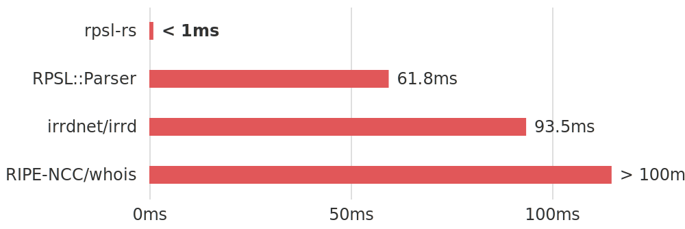

# benchmark

Benchmarks comparing performance to other RPSL parsers.

## Results

| Parser           | Mean              | Min       | Max       | Compiler / Runtime                              |
| ---------------- | ----------------- | --------- | --------- | ----------------------------------------------- |
| **rpsl-rs**      | **508.67 µs**     | 509.11 µs | 509.67 µs | rustc 1.81.0 (eeb90cda1 2024-09-04) LLVM 18.1.7 |
| [RPSL::Parser]   | 61.8 ms ± 2.5 ms  | 60.1 ms   | 74.7 ms   | perl v5.36.0                                    |
| [RIPE-NCC/whois] | 114.7 ms ± 6.3 ms | 106.5 ms  | 124.6 ms  |                                                 |
| [irrdnet/irrd]   | 114.8 ms ± 0.9 ms | 113.5 ms  | 116.7 ms  |                                                 |

_Parsing of the AS3257 aut-num object on a 2022 M1 Max running macOS 15.0 (24A335)._

## Methology

For each benchmarked parser, a small executable is created in its native language that parses the AS3257 aut-num object.
With the exception of [RIPE-NCC/whois], the AS3257 object is included as a string literal. To benchmark [RIPE-NCC/whois], the AS3257 object has to be read from a file since Java limits the length of string literals.

## Running Benchmarks

Benchmarks for the parser itself are done using `cargo bench`, while any external parser is benchmarked using [hyperfine].\
To run specific benchmarks, execute `/.run` in the directory of the respective parser.
It sets up dependencies and runs `sudo` so it is only recommended to be used in an isolated environment and is only tested on Ubuntu 22.04, other platforms might require additional dependencies to be installed.

[RPSL::Parser]: https://metacpan.org/pod/RPSL::Parser
[irrdnet/irrd]: https://github.com/irrdnet/irrd
[RIPE-NCC/whois]: https://github.com/RIPE-NCC/whois
[hyperfine]: https://github.com/sharkdp/hyperfine
